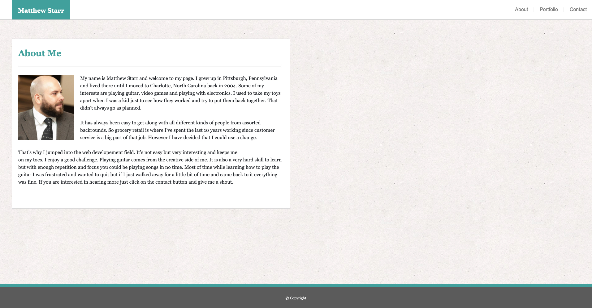

# Bootstrap

## Description

This is a responsive website built for 980px 768px and 640px wide using Bootstrap to showcase a Portfolio to work with multiple screen sizes. I used Bootstrap's grid system (containers, rows, and columns) to layout this project.

## Installation Instructions 

 * Clone Repo to your local machine
 
 * Open HTML file with default browser
 
    _**or**_
               
 * Click on Github Deployed Link below

## How It Works

 * User will be directed to the About page where you can learn a little bit more about Me.  
 
 * The navigation to About, Portfolio and Contact pages is on the top right of the screen.

 * Click on the Portfolio page to see a mockup of different projects. 
 
 * Click on Contact to send your Contact information.

## Github Repo Link

https://github.com/Mstarr85/Bootstrap

## Github Deployed Link

https://mstarr85.github.io/Bootstrap/
 

## Technologies Used

 * HTML
 * CSS
 * Bootstrap

## Author

Matthew Starr

## Future Developement 

I don't specifically have future plans for this project however I plan to make another portfolio project based off of this one once I have actual projects to link to. 

## License

Copyright (c) Matthew Starr. All rights reserved.

Licensed under the [MIT](https://github.com/microsoft/vscode/blob/main/LICENSE.txt) license.
